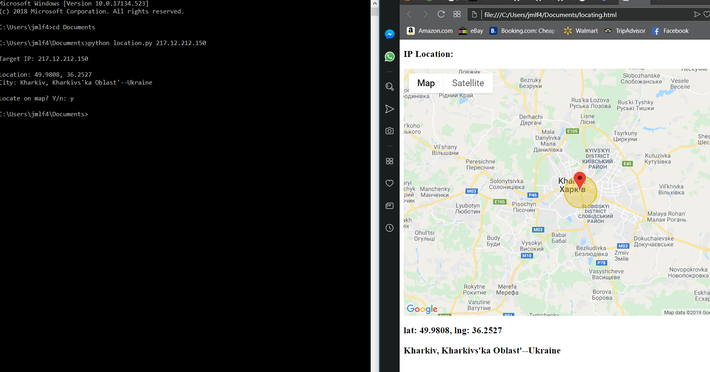

# IpGeolocation
Short script to find the relative location of an IP address

### IP geolocation is typically NOT 100% accurate, and will not lead you to the exact location of the device you are searching.
#### Additionally, if the target is acting through a proxy server, you will find the proxy server instead.
It utilizes two APIs to: 
  1. Fetch IP data
  2. Open and plot on a map
  
Of course, this means that the API keys are hidden, and so the code will not work as shown without your own keys. 

For obtaining ip data:
https://ipstack.com

For creating the map: https://developers.google.com/maps/documentation/

##### To use: `python <location of file> <target ip>`

In the image above, I run the script with an IP address of a proxy server in Ukraine. This creates an HTML file, "locating.html", that is saved to your current directory and subsequently opened to view the location of the IP address. Testing the script on foreign proxy servers is quite simple to do, as their IP addresses are publicly available, and located around the world. The circle around the location marker depicts a 3 mile radius, within which the target IP is likely to be found. This is not guaranteed, however, as IP geolocation is not 100% accurate.

For linux users, the webbrowser module must call webbrowser.open(), whereas for Windows/Mac, it calls webbrowser.open_new_tab().

##### Not a finished product
Yes, there is some excess code in it, and it's not very clean, but it's the first commit. In the future, I will be coming back to update it with more features, including a packet sniffer that maps out source/destination pairs of intercepted packets on the map. The current html document created by the script currently looks rather ugly, and will be updated as well. 
